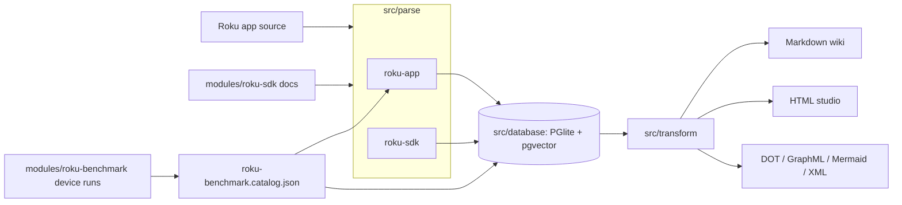
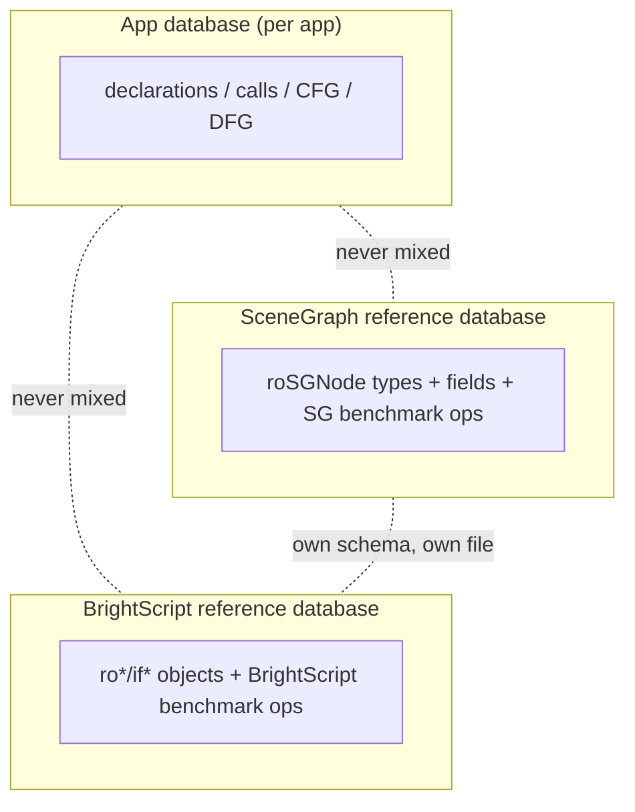

# roku-graphify

BrightScript/BrighterScript code graph analysis tool, powered by the [`brighterscript`](https://github.com/rokucommunity/brighterscript) compiler (v1 alpha). Parses a Roku app (source + components) into a rich graph — declarations, calls, reads/writes, control flow, local data flow, and best-effort performance estimates — persisted in an embedded database, then exportable as a Markdown wiki, static HTML studio, DOT/GraphML/Mermaid/XML, or queried directly.

## How it fits together

```
modules/                          Git submodules
  roku-sdk/                       Roku developer docs (scraped for the SDK reference graph)
  roku-benchmark/                 rokucommunity/bsbench, real-device BrightScript micro-benchmarks

packages/                         Standalone integrations, not used by src/ for parsing
  graphify/                       Tree-sitter grammar for BrightScript (Rust, native Node addon)
  code-review-graph/              Thin adapter stub, will port src/database's output into the code-review-graph
                                   SQLite format once that's worth doing
  rooibos/                        (empty, reserved)

src/
  parse/
    roku-app/                     Parses one Roku app via the brighterscript compiler: declarations, calls,
                                   reads/writes, a hand-built CFG, an approximate local-variable DFG, and
                                   best-effort copy-vs-reference/cost annotations
    roku-sdk/                     Scrapes modules/roku-sdk's markdown docs into an SDK reference graph
    roku-benchmark/                Runs modules/roku-benchmark against a real device and maintains a checked-in,
                                   incrementally-updated benchmark catalog
  database/                       Embedded PGlite (WASM Postgres + pgvector) GraphStore, the persistence layer
                                   every parser writes into
  transform/                      Graph -> export format (JSON/Markdown wiki via @sentropic/graphify;
                                   DOT/GraphML/Mermaid/XML hand-rolled)
  grammar/ebnf/                   Generates EBNF grammar documentation from packages/graphify's grammar.js and
                                   the SDK reference graph
  cli/                            Command-line entry points (below)

examples/roku-app/                A full sample Roku app for exercising cli.analyze-app.mjs
exports/                          Generated reference-graph artifacts (gitignored)
.artifacts/                       Raw/ephemeral capture output, e.g. bsbench runs (gitignored)
```



### Three databases, deliberately kept separate

- **An app's own database** (`cli.analyze-app.mjs` → `<app-dir>/graphify-output/.graphify-state/graph.pgdata`) — that app's declarations/calls/CFG/DFG only. Benchmark cost estimates get baked into `CALLS` edges (`extra.estimatedMicroseconds`) at parse time, but no raw benchmark rows are stored here — reference data never pollutes an app's own graph or community detection.
- **The SceneGraph reference database** (`exports/scenegraph/`) — `roSGNode` types, their fields, and SceneGraph-relevant benchmark ops.
- **The BrightScript reference database** (`exports/brightscript/`) — core `ro*`/`if*` language objects/interfaces and BrightScript-language benchmark ops.

The SceneGraph/BrightScript split mirrors how Roku developers already think about the platform. Both reference databases share the exact same schema as an app's own database (`nodes`/`edges`/`metadata` — see `src/database/pglite/pglite.db.mjs`), just as separate files, built once via `cli.generate-sdk-exports.mjs` and meant to be reused across every app analyzed rather than rebuilt per app.



### What gets extracted per BrightScript function (`src/parse/roku-app/`)

- **Declarations & structure**: functions, classes, methods, fields, interfaces, enums, consts, namespaces, SceneGraph component composition (`roku-app.brs.mjs`, `roku-app.xml.mjs`)
- **Calls & data flow**: `CALLS`/`INSTANTIATES`/`READS`/`WRITES` edges, each tagged `RESOLVED`/`TEXTUAL`/`DECLARED` by how confidently the target was matched
- **Control-flow graph**: basic blocks + `FLOWS_TO` edges (`roku-app.cfg.mjs`), plus `cyclomaticComplexity`/`maxNestingDepth`/`exitPointCount` and a rudimentary Big-O estimate from loop-nesting depth
- **Local-variable data-flow graph**: `LocalDef` nodes + scope-aware `USES` edges (`roku-app.dfg.mjs`), backed by a thin adapter (`roku-app.flow-adapter.mjs`) around `brighterscript`'s own `SymbolTable`/`PocketTable` internals — with a documented swap-to-hand-rolled fallback path if a future compiler release changes that shape
- **Copy-vs-reference semantics**: best-effort `roSGNode` (always by-reference) vs `Array`/`AssociativeArray` (deep-cloned crossing a node boundary — `m.top.*` field access, `.callFunc(...)`) tagging on the relevant edges
- **Cost estimates**: real `estimatedMicroseconds` where a `CALLS` edge matches a measured benchmark op, else the CFG's Big-O estimate

## CLI usage

```bash
npm install

# Analyze a single .brs/.bs file (no cross-file resolution)
node src/cli/cli.analyze-file.mjs [--summary] <file.brs> [...]

# Analyze a whole Roku app directory (must contain source/ and components/)
node src/cli/cli.analyze-app.mjs <app-dir> [output-dir]

# Rebuild the SceneGraph + BrightScript reference databases from SDK docs
node src/cli/cli.generate-sdk-exports.mjs [<sdk-docs-path>]

# Run bsbench against a real Roku device, update the checked-in benchmark catalog
node src/cli/cli.run-benchmark.mjs [--host 192.168.18.17] [--password 1234] [--only PATTERN] [--quiescence-ms 8000]
```

Or via npm scripts: `build-grammar`, `test`, `analyze-app`, `analyze-file`, `generate-sdk-exports`, `generate-ebnf`, `run-benchmark`.

`cli.analyze-app.mjs` writes to `<app-dir>/graphify-output/` by default:

- `.graphify-state/graph.pgdata` — the embedded PGlite database
- `.graphify-state/graph.json` — raw graph data
- `wiki/` — Markdown wiki pages, one per detected community
- `studio/index.html` — self-contained static HTML graph explorer

The globally installed CLI binary is `roku-graphify` (see `bin` in `package.json`), mapping to `cli.analyze-file.mjs`.

## Benchmark catalog

`src/parse/roku-benchmark/roku-benchmark.catalog.json` is checked into the repo — one row per bsbench test (492 total), with a real description of the operation it measures and a link to its source file, built by reading every benchmark file directly rather than inferring from names. Cost fields (`microsecondsPerOp`, `min`, `max`, `sampleCount`, `measuredAt`) start `null` and get filled in by `cli.run-benchmark.mjs` runs against a real device — a device is only needed to *refresh* the numbers, not to have the catalog at all. 13 suites are genuinely cross-cutting (e.g. comparing a SceneGraph-node field against a local variable) and are tagged `comparativeSuite: true` since their rows land in both reference databases by design.

## Submodules

```bash
git submodule update --init --recursive
```

- `modules/roku-sdk` — Roku developer docs, scraped by `src/parse/roku-sdk`
- `modules/roku-benchmark` — bsbench; needs its own `npm install` before `cli.run-benchmark.mjs` can use it

## License

MIT
